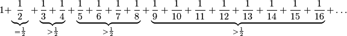

# Wachstum der harmonischen Reihe

Die harmonische Reihe

\\[
1+{1\over 2}+{1\over 3}+{1\over 4}+{1\over 5}+{1\over 6}+{1\over 7}+\ldots
\\]

ist eine Reihe, die sehr langsam divergiert.

Das die harmonische Reihe divergiert erkennt man leicht daran,
dass bestimmte Teilsummen größer als $1/2$ sind:

<!--
\\[
1+\underbrace{1\over 2}_{= {1\over 2}}+\underbrace{ {1\over 3}+{1\over 4}}_{> {1\over 2}}+\underbrace{ {1\over 5}+{1\over 6}+{1\over 7}+{1\over 8}}_{> {1\over 2}}+\underbrace{ {1\over 9}+{1\over 10}+{1\over 11}+{1\over 12}+{1\over 13}+{1\over 14}+{1\over 15}+{1\over 16}}_{> {1\over 2}}+\ldots
\\]
-->

Trotzdem wächst diese Reihe nur sehr langsam. Damit die Summe

\\[
s_k =
\sum_{i=1}^k{1\over i}
\\]

einen gegebenen Wert $w$ übersteigt, müssen in der Regel sehr viele Werte aufsummiert werden.
Die folgende Tabelle zeigt, wieviele Werte notwendig sind um eine bestimmte Schranke zu überschreiten.

\\[
\begin{array}{ccccc}
s_3 & <& 3 &<&s_4\\\\s_{10} & <& 3 &<&s_{11}\\\\s_{30} & <& 4 &<&s_{31}\\\\s_{82} & <& 5 &<&s_{83}\\\\s_{226} & <& 6 &<&s_{227}\\\\s_{615} & <& 7 &<&s_{616}\\\\s_{1763} & <& 8 &<&s_{1674}\\\\s_{4549} & <& 9 &<&s_{4550}\\\\s_{12366} & <& 10 &<&s_{12367}\\\\
\end{array}
\\]

Im Folgenden Applet kann man mit den aufsummierten Summengliedern experimentieren.
An den beiden weißen Punkten lässt sich die Skalierung der Achsen verändern.

Mit dem roten Punkt kann man einen bestimmten zu erreichenden Summenwert einstellen.
Das Diagramm wird dabei bei Bedarf nach links verschoben.



*Experimentelle Arbeitsfrage:*  
Wenn mann eine schon erreichte Summe $s_i$ um $1$ erhöhen will also
ein $s_j\approx s_i+1$ erreichen will, 
wie groß muss dann ungefähr $j$ sein?
