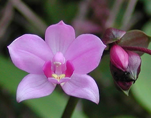
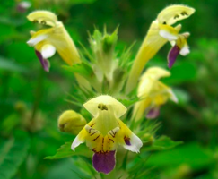
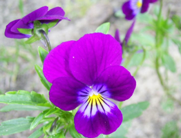

# Spiegelung

Spiegelsymmetrien gehören zu einer der Grundformen symmetrischer Strukturen, die auch im Pflanzenreich sehr häufig auftreten.
Viele Blüten wachsen derart, dass eine Spiegelung ihrer linken Hälfte identisch zu ihrer rechten Hälfte aussieht.
Bekannte Beispiele dafür sind Orchidee, Veilchen oder Löwenmäulchen.

Im Applet unten kann man mit spiegelsymmetrischen Strukturen spielen. Man kann die Objekte
verschieben und mit Hilfe der weißen Punkte drehen. Automatisch werden spiegelsymmetrische Kopien mitbewegt.



