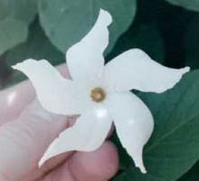

# Rotation

Eine zweite Grundform der Symmetrie ist die so genannte Drehsymmetrie. Sie ist gegeben durch bestimmte Formen der Rotation.
Symmetrisch nennen Mathematiker ein Objekt dann, wenn man es verändern (in diesem Falle drehen)
kann, so dass es nach der Veränderung nicht von der Ursprungssituation zu unterscheiden ist.
Reine Drehsymmetrien treten im Pflanzenreich nicht extrem häufig auf. Man findet sie z.B. bei bestimmten Jasminarten oder bei Oleander.

Mit dem Applet unten kann man drehsymmetrische Bilder erzeugen. Die Objekte sind frei bewegbar und können durch die weißen Punkte
am rechten Rand selbst gedreht werden. Am Schieberegler links oben kann man die Anzahl der Drehsymmetrien einstellen.
Diese ist immer eine ganze Zahl. Zwischen den einzelnen gedrehten Kopien der Objekte bilden sich dabei
ganz bestimmte Winkel aus. Die Größe des Winkels ist dabei 360° geteilt durch
die Anzahl der drehsymmetrischen Objekte. Für 2-, 3-, 4-, 5-, 6-zählige Drehsymmetrien ergeben sich der Reihe nach
Winkel von 180°, 120 ° 90°, 72°, und 60°.

  

