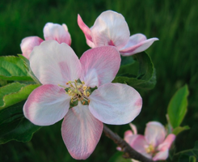
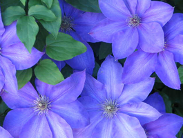
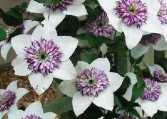

# Rotation und Spiegelung

Eine bei Blüten sehr häufig vorkommende Symmetrieform ist eine Kombination von Dreh- und Spiegelsymmetrie.
(Die Beispiele oben zeigen eine Apfelblüte und zwei Sorten von Clematis.) Im Applet unten kann man mit
der kombinierten Dreh- und Spiegelsymmetrie experimentieren. Die Winkel zwischen den Spiegelachsen
werden hierbei immer Teiler von 180° sein, also 90°, 60°, 45°, 36°, 30°,... .



