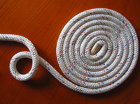
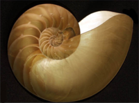

# Grundformen von ebenen Spiralen

Spiralen spielen in Natur und Technik eine herausragende Rolle.
Besonders im Pflanzenreich entdeckt man immer wieder spiralförmige
Wachstumsformen. Eine Spirale entsteht dadurch, dass eine Linie zunächst kreisförmig aufgerollt wird,
dabei aber der Radius fortlaufend verändert wird. Das folgende Applet veranschaulicht Grundformen von häufig auftretenden
Spiralmustern.



Bei der <em>Archimedischen Spirale</em> wird pro Kreisumdrehung der Radius um einen festen Wert vergrößert.
Man kann sich die so entstehende Spirale wie ein aufgewickeltes Seil vorstellen, bei dem pro Umdrehung der
Kreisumfang um die Seildicke verändert wird.

Bei der <em>Logarithmischen Spirale</em> wird der Radius pro Umdrehung um einen bestimmten Faktor verändert (z.B. immer verdoppelt).
Die logarithmische Spirale ist für Wachstumsprozesse sehr wichtig und findet sich z.B. in Schneckenhäusern wieder.

Bei der <em>Wurzelspirale</em> (auch <em>Fermatsche Spirale</em> genannt) wird der Umfang gemäß einer Wurzelfunktion vergrößert.
Diese Spiralenform ist speziell für das Wachstum von Samen in einer Sonnenblume wichtig.
