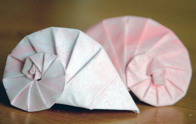

# Spiralen durch Drehstauchung

Origamidesign von Tokomoko Fuss

Spiralartige Formen sind im Pflanzen- und Tierreich sehr häufig. Im Applet unten kann man mit einer
speziellen Art von Spiralmustern spielen, das eine große Vielzahl von Mustern hervorbringen kann.
Wir beginnen mit einem Viereck (dessen Eckpunkte frei beweglich einstellbar sind, sogar Selbstüberschneidungen der Kanten sind erlaubt).
Bezeichnen wir zwei der gegenüberliegenden Seiten des
Vierecks mit A und mit B. Angenommen, die Seite B ist kürzer als die Seite A.
Wir nehmen nun eine verkleinerte Kopie des Vierecks, bei der die ensprechende Seite A' so lang ist wie die
ursprüngliche Seite B. Diese verkleinerte Kopie legen wir mit A' an die Seite B des Originalvierecks an.
Wir verfahren nun genauso mit der verkleinerten Kopie und legen auf diese Art und Weise viele immer
kleiner werdende Kopien des Vierecks aneinander.

Im Applet unten kann man die vier Eckpunkte des Originalvierecks
frei bewegen. Es entstehen dabei sehr viele unterschiedliche Spiralformen
(Experimentieren lohnt sich). Die Vierecke werden der Reihe nach eingefärbt.
Am oberen Schiebeschalter kann man die Anzahl der Farben einstellen.
Am unteren Schieberegler kann man die
die Anfangsfarbe einstellen.

  

