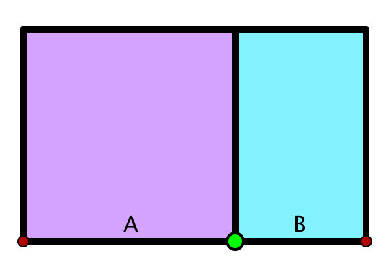

# Der Goldene Schnitt

Der Goldene Schnitt ist eine ganz bestimmte Zahl. Diese wird für das Verständnis von Pflanzenwachstum eine entscheidende Rolle spielen.
Mathematisch kann man diese Zahl z.B. folgendermaßen definieren:
Eine gegebene Strecke wird durch einen  Punkt in zwei Strecken A und B unterteilt. Diese Teilung entspricht dem <em>Goldenen Schnitt</em>,
wenn das Verhältnis B/A der kleineren zur größeren Strecke das gleiche ist wie das Verhältnis A/(A+B) der größeren Strecke A
zur Gesamtlänge A+B. Diese Teilung wird für genau einen Punkt erreicht. Man nennt dann das Teilverhältnis B/A den Goldenen Schnitt.

Im folgenden Applet kann man experimentell herausfinden, wie groß der Goldene Schnitt als Zahl ist.
Mit dem grünen Punkt kann man das Teilverhältnis verändern. Die betreffenden Verhältnisse werden am Rand angezeigt.
Man muss den Schiebeschalter so bewegen, dass B/A=A/(A+B) ist. Dann ist der Goldenen Schnitt erreicht.

Außerdem sieht man eine geometrische Darstellung des Goldenen Schnittes. Es wird als großes Rechteck ein Rechteck mit Breite A+B und Höhe A gezeichnet.
Das kleine türkisfarbene Rechteck hat eine Breite von B und eine Höhe von A. Dreht man dieses um 90°,  ist der Goldene Schnitt genau dann erreicht, wenn
dieses und das äußere große Rechteck ähnlich sind (d.h. einfach vergrößerte Kopien voneinander). Dies ist genau dann erreicht, wenn die rote Gerade
durch die Spitze des großen Rechtecks geht.
  


Man sieht, dass sich der Goldene Schnitt recht genau bei dem Verhältnis 0.618... einstellt. Tatsächlich ist der Goldene Schnitt
eine irrationale Zahl (d.h. eine Zahl, die sich nicht als Bruch schreiben lässt). Auflösen der Gleichung:
\[ {B\over A}={A\over A+B} \]

ergibt für $\phi ={B\over A}$

\[ \phi={\sqrt{5}-1\over 2}=0.618033988749894848204586834366\ldots \]

Ein <em>Goldenes Rechteck</em> ist ein Rechteck, dessen Seitenverhältnis den Goldenen Schnitt ergibt.
Eine schöne geometrische Eigenschaft des Goldenen Schnittes ist die folgende:
Trennt man von einem Goldenen Rechteck ein Quadrat (lila) ab, so erhält man wieder ein Goldenes Rechteck (türkis).

Durch seine Definition hat der Goldene Schnitt einige bemerkenswerte Eigenschaften.
Es gilt z.B.

\[ {1\over\phi}=1+\phi=1.618033988749894848204586834366\ldots \]

\[ \phi^2=1-\phi=0.38196601125010515179541316563\ldots \]

Ferner lässt sich der Goldene Schnitt durch einen sehr regelmäßigen Kettenbruch (be)schreiben:

\[ \phi= {1\over 1+{1\over  1+{1\over  1+{1\over 1+{1\over 1+{1\over  1+{1\over \ldots}}}}}} } \]

oder als Kettenwurzel:
\[ \phi= \sqrt{1+\sqrt{1+\sqrt{1+\sqrt{1+\sqrt{1+\sqrt{1+\sqrt{1+\sqrt{1+\ldots}}}}}}}} \]
