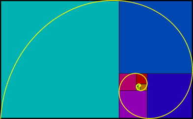

# Fibonacci-Zahlen und der Goldene Schnitt I
Hier kommt eine geometrische Deutung der Fibonacci-Zahlen:

Beginnen wir mit einem Quadrat (der Kantenlänge 1) und legen an dieses Quadrat ein weiteres Quadrat derselben Kantenlänge an.
An das so entstehende Rechteck legen wir an die längere Kante nun wieder passend ein Quadrat an (das hat jetzt Kantenlänge 2).
An das nun entstandene Rechteck legen wir wieder an die längere Seite ein Quadrat an (das hat jetzt Kantenlänge 3), und so weiter.

Die angelegten Quadrate werden der Reihe nach als Kantenlängen die Fibonacci-Zahlen annehmen. Im Applet unten kann man am
unteren Schieberegler diese Folge von geometrischen Figuren anschauen. Am oberen Regler kann man die gezeigte Figur verkleinern.

  


Bemerkenswert ist, dass das entstehende Rechteck bei diesem Prozess einem <a href="{{ '/Botanik/3-1.html' | relative_url }}">Goldenen Rechteck</a> immer ähnlicher wird.
Das Verhältnis von großer und kleiner Seite des Rechtecks nähert sich dem Goldenen Schnitt immer näher an. Man kann dies sehr schön beobachten, indem man
das entstehende Bild mit dem Bild im Applet zur <a href="{{ '/Botanik/3-4.html' | relative_url }}">Goldenen Spirale</a> vergleicht. Dieses ist zum Vergleich nochmal unten abgebildet

