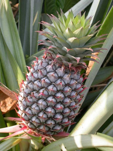
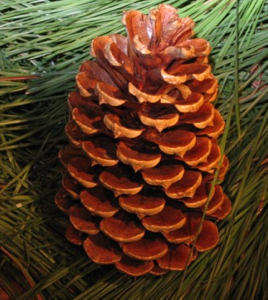
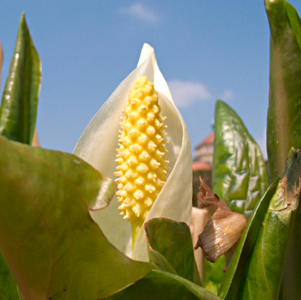

# Fibonacci-Zahlen und die Ananas

Der im <a href="{{ '/Botanik/4-4.html' | relative_url }}">vorletzen Beispiel</a> beobachtete Effekt der durch den Goldenen Schnitt erzeugten dichten Gitterpackung
führt zu einem im Pflanzenreich sehr weit verbreiteten Phänomen. Hierzu müssen wir nur den dort betrachteten Streifen um eine
zylinderförmige Struktur wickeln. Der rechte Rand des Streifens wird dadurch auomatisch mit dem linken Rand verklebt.
Die Regeln für das Setzen der Samenkörper sind dann folgendermaßen:

 <ul>
<li> Für jedes Samenkorn geht man das gleiche Stück $\Delta y$ in Richtung der Zylinderachse weiter.
</li> <li> Jedes neue Samenkorn wird gegenüber dem vorherigen um einen Goldenen Winkel (137.508°) versetzt auf dem Kreisrand des Zylinders platziert.
</li></ul>

Die letzte Regel entspricht dem bei den Gitterpackungen auftretenden Weitergehen um den Goldenen Schnitt. Die dadurch auftretende Struktur kann man bei vielen
verschiedenen Pflanzen beobachen: Ananas, Tannenzapfen, Rittersporn, etc.

Im folgenden Applet kann man nun mit einem derartigen Blütenstand experimentieren.
Man kann die gezeigte dreidimensionale Struktur mit der Maus anfassen und drehen.
Durch Drücken des "Play"-Knopfes kann sie auch kontinuierlich gedreht werden. Das Weiterschreiten
in Richtung der Zylinderachse ist am zweiten Schieberegler veränderbar (die Körnergrößen werden dabei automatisch angepasst).
Am unteren Schieberegler kann man das Fortschreiten im Goldenen Winkel stören.
Dabei treten dann diverse Spiralarme deutlich zu Tage.

Eine wichtige Beobachtung ist, dass die Anzahl der beobachtbaren Spiralen immer eine Fibonacizahl ist.
Dies kann man auch bei echten Pflanzen (meistens) feststellen.
  

