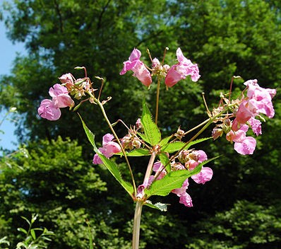

# Blattstand beim Springkraut

Bildquelle: Wikimedia-Commons

<strong>Der Sonne entgegen:</strong> Einige Pflanzen (wie zum Beispiel das Springkraut) haben über die Jahre hinweg
Wachstumstrategien entwickelt, die es ermöglichen, dass jedes Blatt möglichst viel Sonne bekommt. Im Prinzip versucht dabei jedes Blatt so zu wachsen, dass
es die größtmögliche Lücke zwischen den bisher gewachsenen Blättern ausfüllen kann.
Jedes einzele Blatt wächst dabei nach einem so genannten "expotentiellen Wachstum": Es verdoppelt seine Größe
in gleichen Zeitabständen (zumindest bis es eine Maximalgröße erreicht hat). Wenn es also an einem Tag von einem Zentimeter Länge auf
zwei Zentimeter Länge wächst, so wird es am Tag darauf vier Zentimeter und noch einen Tag später 8 Zentimeter lang sein.

Wachsen die einzelnen Blätter nach diesem Muster, so kann man die größte Lücke nach folgender (erstaunlichen) Regel finden:
Die Position, an der ein Blatt aus dem Stengel wächst, ist genau um 137,5° um die Position des vorherigen Blattes verdreht.

Im folgenden Applet kann man mit verschiedenen Variationen des Blattstandes spielen:
Man kann an den Schiebereglern das Alter der Pflanze (also die Größe der Blätter), die Anzahl der Blätter und den
Winkel von einem Blatt zum nächsten verstellen. Man stellt fest, dass bei 137,5° jedes neue Blatt sehr gut in die Lücke der vorangegangenen Blätter
hineinpasst. Tatsächlich macht die Natur die Blätter sogar noch ein wenig asymmetrisch, um die Lücken noch ein bisschen besser auszunutzen.
Damit kann man mit dem letzen Schieberegler experimentieren.

Nummeriert man die Blätter (mit der Zahl 0 beginnend) fortlaufend durch, so stellt man fest, dass
immer dann, wenn die Blattzahl eine Fibonacci-Zahl ist, das Blatt ziemlich genau in die gleiche Richtung zeigt wie das nullte Blatt.
Dieser Effekt tritt natürlich erst bei den etwas größeren Fibonacci-Zahlen wie 5, 8, 13, 21, 34,... deutlich zu Tage.
Je größer die Fibonacci-Zahlen sind, umso deutlicher ist dieser Effekt. Es ist spannend, in der freien Natur nach diesem Wachstumsmuster zu suchen.
Es tritt häufiger auf als erwartet.



