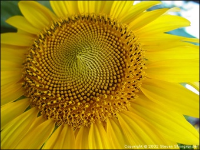

<h1>  Blütenstand bei der Sonnenblume </h1>

<table  align="left"><tr><td>     
</td><td width="20"></td></tr>
<tr><td>Foto: Steven Shongrunde (2002)</td></tr>
<tr><td height="20"></td></tr></table>
<table><tr><td width="500" >
<table align="right">
<tr><td>

</td></tr>
<tr><td>
Schachbrett
</td></tr>
<tr><td>

</td></tr>
<tr><td>
Bienenwaben
</td></tr>
<tr><td>

</td></tr>
<tr><td>
Spirale (innen)
</td></tr>
<tr><td>

</td></tr>
<tr><td>
Spirale (außen)
</td></tr>
<tr><td height="200">
</td></tr>
</table>
<strong>Dicht an Dicht:</strong> Im Blütenstand der Sonnenblume sind jeweils ungefähr gleich große Samenkerne sehr dicht gepackt.
Schöne dichte Packungen gleichgroßer Objekte erhielte man beispielsweise, wenn man die Samen in einem viereckigen schachbrettartigen oder sechseckigen bienenwabenförmigen Muster anordnen würde. Dies wäre allerdings nicht mit den Wachstumsprozessen in einer Pflanze vereinbar, da dazu jedes Samenkorn in seiner fertigen Größe, ohne zu wachsen, an  die bereits existierenden angereiht werden müsste.

Tatsächlich folgt die Sonnenblume einem Wachstumsprozess, der ganz regelmäßig ist und fast an die Dichte von Bienenwabenpackungen herankommt:
Jeder Sonnenblumensamen  entsteht in der Mitte der Blüte und wird - wenn die Sonnenblume größer ist - von der Mitte aus an den Rand "geschoben". Die Richtung, in die es weggeschoben wird, ändert sich von Korn zu Korn um einen Winkel von 137,508° (was es mit diesem Winkel auf sich hat, wird später erklärt werden).
Hierbei bildet sich im Inneren der Sonnenblume zunächst eine etwas konfuse Anordnung. Am Rand der Sonnenblume bilden sich allerdings ganz regelmäßige Spiralen von Samenkörnern aus. Je weiter man an den Rand geht, desto mehr Spiralen nimmt man wahr. Im Applet unten sieht man die Anordnung von Sonnenblumensamen für
die gewaltig große Anzahl von 1250 Samenkörner (tatsächlich hat eine Sonnenblume sogar oft noch mehr Samen).
Zum Rand der Kreisscheibe scheint das Packungsmuster je nach Position zwischen Schachbrett und Bienenwabe hin und her zu wechseln.
</td></tr></table>

<h2>  Im Applet kann man einige Dinge ausprobieren: </h2>
<table><tr><td width="800"> <ol>
<li> Zunächst kann man am oberen Schieberegler den Winkel verändern. Man sieht schnell, dass - wenn der Winkel größer oder kleiner wird - die dichte Packung aufbricht und einzelne Spiralarme deutlich sichtbar werden.
</li> <li> Am rechten Schieberegler kann man die Sonnenblume wachsen lassen. Man kann sehen, wie sich die Samenkerne wärend des Wachstums zunächst schnell, dann immer langsamer nach außen bewegen.
</li> <li> Am linken Schieberegler kann man zustzlich noch einige Körner markieren, um deren Wachstum besser zu verfolgen.
</li> <li> Mit dem Schalter "Farbspiralen" kann man die Kerne einfärben (Erkärung unten).
</li></ol>
</td></tr></table>



<h2>  Einige Experimentiervorschläge </h2>

<table><tr><td width="800"> <ul>
<li> <strong>Den Winkel variieren:</strong> Am oberen Schieber ziehen und sehen, wie sich Spiralarme abzeichnen. Die Anzahl der Arme wir dabei eine Fibonacci-Zahl sein, also 1,2,3,5,8,13,21,34,55,89,...
</li> <li> <strong>Körner beim Wachsen beobachten:</strong> Schiebt man den linken Schieber nach oben, so wird jedes k-te Samenkorn schwarz gefärbt; k ist dabei die Zahl, die am Schieber eingestellt ist. Stellt man den Schieber z.B. auf 31, so wird jedes 31ste Korn eingefärbt. Betätigt man nun den Wachstumsschieber rechts, so kann man sehen, wie die Körner einfach zum Rand hin wachsen.
</li> <li> <strong>Markierungszahlen ausprobieren:</strong> Je nachdem, an welche "wievielten" Kerne man eine Markierung anbringt, ergeben sich andere Muster von schwarzen Punkten. Immer wenn diese Zahl eine Fibonacci-Zahl ist, ergibt sich eine einfache Spirale. Bei Vielfachen von Fibonacci-Zahlen ergeben sich ausgedünnte Spiralen, bei Teilern von Fibonacci-Zahlen ergeben sich mehrfache Spiralen.
</li> <li> <strong>Farbspiralen:</strong> Man kann die im vorherigen Punkt beschriebenen Spiralenmuster noch deutlicher sichtbar machen, wenn man den Schalter "Farbspiralen" betätigt. Steht der Markierungsschieber dann z.B. auf "5", so werden fünf aufeinanderfolgende Körner in fünf verschiedenen Farben eingefärbt. Danach wiederholt sich das Farbmuster wieder. Wieder ergeben sich besonders interessante Farbmuster für Fibonacci-Zahlen.
</li></ul>
</td></tr></table>
