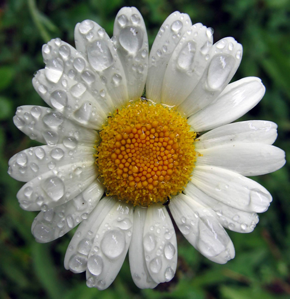

<h1>  Pollenkapseln bei der Kamillenblüte </h1>

<table  align="left"><tr><td>          

</td><td width="20"></td></tr>
<tr><td>Bildquelle: www.herbalextractsplus.com</td></tr>
<tr><td height="20"></td></tr></table>
<table  ><tr><td width="400">    
Im Gegensatz zu Sonnenblumenkernen wachsen bei einigen Pflanzen die inneren Teile des Blütenstandes mit der Pflanze mit und werden dabei immer größer.
Ein Beispiel hierfür sind die Pollensäcke bei der Kamille. Auch hier ist es für die Pflanze erstrebenswert, auf engem Platz möglichst viele
derartige Pollensäcke unterzubringen. Das "Kochrezept" hierfür ist das gleiche wie für die Sonnenblume:
Die Pollensäcke bewegen sich beim Wachstum der Pflanze Stück für Stück nach außen (und wachsen dabei).
Die Richtung ändert sich hierbei wieder nach jedem Pollensack um 137,508°. Auch hier erhält man wieder eine dichte Packung. Im Gegensatz zur Sonnenblume nimmt allerdings die
Wachstumsgeschwindigkeit zum Rand hin nicht ab.

Im folgenden Applet kann man - genau wie beim Sonnenblumenapplet - den Winkel verändern, das Wachstum der Pflanze beobachten und einzelne Kreisscheiben markieren.
Die Effekte sind ähnlich wie bei den Sonnenblumenkernen, nur, dass die Spiralen hier insgesamt regelmäßiger aussehen.
</td></tr><tr><td height="20"></td></tr></table>

  

