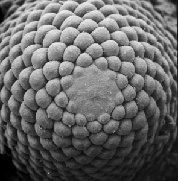

<h1>  Wie Sonnenblumenkerne wachsen </h1>
<table  align="left"><tr><td>  
</td><td width="20"></td></tr>
<tr><td>Bildquelle: Rolf Rutishauser, Zürich</td></tr>
<tr><td height="20"></td></tr></table>
<table><tr><td width="450" >
Natürlich entstehen die Sonnenblumenkerne
nicht plötzlich an den im <a href="{{ '/Botanik/5-4.html' | relative_url }}">letzten Applet</a> gezeigten Positionen. Sie sind Ergebnis eines Wachstumsprozesses.
Bislang ist es wissenschaftlich noch nicht bis ins letzte Detail geklärt,
wie die Formungsprozesse beim spiralförmigen Wachsum von Blütenständen entstehen.
Es gibt aber einige wichtige Formierungsprinzipien.
Eine wichtige Tatsache ist, dass sich ein einmal entstandener Kern einfach radial (das heißt vom Zentrum weg)
nach außen bewegt. Im Falle der Sonnenblume verlangsamt sich dabei die Wachstumsgeschwindigkeit.

Ein neuer Kern entsteht etwa in der Mitte der Pflanze an der Stelle, wo die bisher gewachsenen Kerne
"den meisten Platz lassen". Dies geschieht bereits auf mikroskopisch kleiner
Skala. Das Bild links zeigt eine Aufnahme eines Fichtensprosses, der gerade mal ca. 2mm groß ist.
Die einzelnen Sprossen werden hierbei später zu Nadeln werden.
In der Mitte kann man sehr schön die Formierung der neuen
Nadeln beobachten.

Im Applet unten kann man das Samenwachstum nach der 137.508° -Regel durch Bewegen des linken Schiebereglers beobachten.
Am rechten  Schieberegler kann man den idealen Winkel leicht vergrößern und verkleinern.

</td></tr>
</table>


