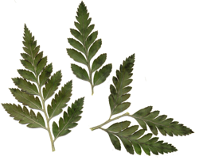

<h1> Farne als Grenzpunktmenge </h1>

<table  align="left"><tr><td></td><td width="20"></td></tr><tr><td>Bildquelle: www.naturespressed.com</td></tr><tr><td height="20"></td></tr></table>

Ein weiteres sehr prominentes IFS ist der so genannte <em>Barnsley Farn</em>.
Die Konstruktion beruht auf der Beobachtung, dass die Blätter eines Farnes selbst wie ein
kleiner Farn aussehen. Dies ist eine recht typische Eigenschaft von Pflanzen: Teile der gesamten Pflanze sehen aus wie die gesamte Pflanze selbst.
(Der Ast eines Baumes z.B. sieht selbst aus wie ein kleiner Baum). Bei der Erzeugung dieses Bildes nutzt man diese Eigenschaft aus. Man
definiert sich Drehstauchungen, die den ganzen Farn auf einen oberen Teil seiner selbst und auf die beiden linken und rechten unteren Blätter
abbilden. Lässt man auf diesen Transformationen eine Grenzpunktmenge berechnen, so entsteht wie von selbst eine
farnartige Struktur. Im Applet unten sind die Transformationen durch Ziehen and den Rechtecken veränderbar.
Durch geeignetes Ziehen kann man sogar eine blattartige Struktur (z.B. Ahornblatt) erzeugen.

  

  