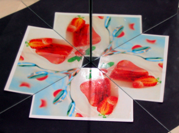
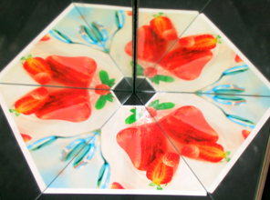
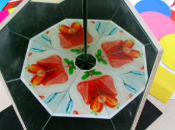
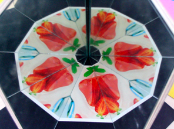

# Winkelspiegel

Sobald unsere Spiegel nicht mehr parallel sind oder gar senkrecht zueinander stehen, ändert sich die Situation drastisch. Betrachten wir folgende "Versuchsanordnung": Wir stellen Dr. Stickler in einen aus klappbaren Spiegeln aufgebauten Winkel.

  


Im Applet oben ist Dr. Stickler zunächst zwischen zwei senkrecht zueinander stehenden Spiegeln platziert. Es ergibt sich ein Spiegelbild in jedem Spiegel. Der vierte Dr. Stickler ist ein gespiegeltes Spiegelbild. Durch den 90°-Winkel überlappen sich bereits nach endlich vielen Schritten die Spiegelbilder wieder und somit entstehen nur endlich viele Spiegelbilder (in dieser Anordnung vier Stück).
Wenn man den Winkel verändert (man kann die Spiegelenden mit der Maus bewegen), so passen die Spiegelbilder nicht mehr exakt aufeinander. Nur bei sehr speziellen Winkeln ergeben sich wieder endlich viele diskrete Spiegelbildkopien. Die "passenden" Winkel müssen Teiler von 180° sein. Genau dann ergeben sich gleich große Winkelsegmente, die den Vollkreis ausfüllen - wie bei einer Pizza oder einem Kuchen, der in gleich große Stücke geteilt wurde.

Die passenden Winkel sind also: 180°, 90°, 60°, 45°, 36°, 30°,... (unbedingt ausprobieren!). Diese Winkel spielen in der Theorie der Reflexionsgruppen eine herausragende Rolle.
Das Ganze funktioniert nicht nur auf dem Computer und ergibt dort schöne Bilder, sondern auch in der Realität. Hier sind ein paar Fotos, die mit einem Klappspiegel und eingelegten Postkarten erstellt wurden. Der Reihe nach sieht man die Winkel 90°, 60°, 45° und 36°, und es ergeben sich 4, 6, 8 oder 10 Sektoren. Die Bilder in den Sektoren sind dabei abwechselnd identisch zum Original und spiegelverkehrt zum Original.

<table>
<tr><td>

</td><td>

</td></tr>
<tr><td>

</td><td>

</td></tr>
</table>
