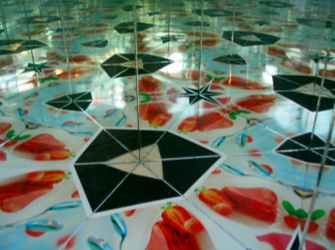
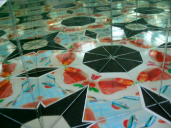
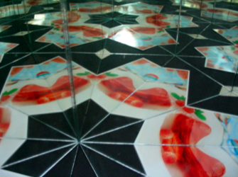

# Kaleidoskope

Was passiert, wenn man nicht nur zwei Spiegel, sondern drei Spiegel verwenden will? Ordnet man drei Spiegel so im Dreieck an, dass an jeder Ecke ein passender Winkel entsteht (also ein ganzzahliger Teiler von 180°), so gibt es dafür nicht sehr viele Möglichkeiten: Die Winkelsumme im Dreieck beträgt 180°, somit kommen als einzige Möglichkeiten die Kombinationen (60°, 60°, 60°), (90°, 45°, 45°) und (90°, 60°, 30°) in Frage. Die drei folgenden Applets demonstrieren die drei daraus entstehenden Ornamentgruppen.

## (60°, 60°, 60°)



## (90°, 45°, 45°)



## (90°, 60°, 30°)



In jedem der Applets ist Dr. Stickler bewegbar.
In der Realität sieht das dann so aus:

