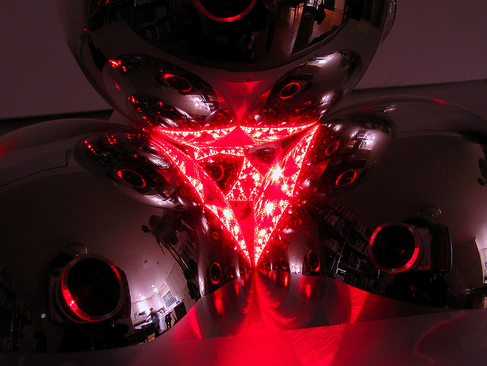

# Indra's Pearls

Mehr zu Indra's Pearls gibt es im Kapitel [IndrasPearls bei MatheVital](/Indras) und auf der [Indra's Pearls Website](http://klein.math.okstate.edu/IndrasPearls).

# Chaos bei Kugelspieglungen

Wird ein Lichtstrahl in eine Anordung von Kreis oder Kugelförmigen Spiegeln geschickt, so kann es passieren, dass dieser sehr oft hin und her reflektiert wird bevor er die Anordung wieder verlässt. Hierbei können kleinste Veränderungen der Positionen große Auswirkungen auf den eintretenden Lichtweg haben. Man spricht von so genanntem deterministischem Chaos.
Das nebenstehende Bild zeigt eine Vergleichb are Situation im Dreidimensionalen. Ein aufgefächerter Laserstrahl wird in eine Anordnung aus vier Christbaumkugeln geschickt. Der Lichtstrahl wird mehrmals hin und her reflektiert. Es entstehen in diesem Fall fraktale Muster.
In der zweidimensionalen Anordnung im Applet kann man das Verhalten eines einzelnen Lichtstrahls in einer Anordnung von kreisförmigen Spiegeln beobachten.

  


Experimentiervorschläge
- Beobachte den Strahlengang wen der Lichtstrahl ausserhalb der Spiegel ist. Kleine Veränderung der Parameter haben große Veränderungen des Licht weges zur Folge.
- Bewegen den Strahlursprung in einen Kreis. Es entstehen regelmäßige sternförmige Muster.
- Bilde zwei sich überlappende Kreise udn zeihe den Strahl hinein. Je nach Parameterwahl entstehend dabei reguläre oder chaotische Strukturen.
