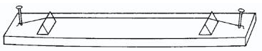

# Ein Monochord

Ein Monochord ist eine Art einfachst mögliches Musikinstrumment. Es besteht aus einer einzigen Saite, die über einen Klangkörper
gespannt ist. Durch Keile, sie man gezielt unter die Saite legt, kann man die Saitenlänge verkürzen und somit die Tonhöhe verändern.
Zumeist wird die Zeite angezupft, manchmal auch mit einem Bogen gestrichen.
In gewisser Weise ist das Monochord Vorläufer der Laute, Gitarre, Harfe, Geige, Klavier, etc.

Die Tohöhe, die bei einem Monochord erklingt, ist abhängig, von der Saitenlänge, der Saitendicke, und der Spannung mit der die Saite gespannt ist.
Hält man zwei dieser Parameter fest, so kann man den dritten variieren und somit physikalisch den Zusammenhang mit der Tonhöhe
ermitteln. Wir wollen uns hier ausschließlich auf die Saitenlänge beschränken.

Wir werden im nächsten Applet noch ein wenig näher auf die genauen physikalischen Gegebenheiten beim Monochord eingehen.
Für hier wollen wir uns mit dem einfachen Zusammenhang von Tonhöhe und Saitenlänge begnügen: _Die Seitenlänge ist umgekehrt porportional
zur Frequenz._ Das heißt: Wird die Saitenlänge halbiert verdoppelt sich die Frequenz und wir nehmen einen
Ton eine Oktave höher war.

Man kann bei untenstehenden Applet den Zusammenhang zwischen Schwingungsform Tonhöhe Saitenlänge und Frequenz beobachten.
Die unverkürzte Saite entspricht einem Grundton von 110Hz (unten einstellbar). Die Schwingung der Saite ist in Form einer Sinuswelle angedeutet.
Verkürzt man nun die Saite (roter Knopf), so verringert man die Wellenlänge der Sinuskurve und die Frequenz wird höher.
Im Prinzip kann man mit einer Saite beliebig hoch werden, indem man den schwingenden Teil immer kürzer macht.
Im praktischen Instrumenten bau sehen dem allerdings physikalische Grenzen entgegen.

  


Grundton:  
<input type="button" value="110 Hz (A)" style="width: 100px;" onclick="doScript(statement[0])" />
<input type="button" value="220 Hz (a)" style="width: 100px;" onclick="doScript(statement[1])" />
<input type="button" value="440 Hz (a')" style="width: 100px;" onclick="doScript(statement[2])" /> 

Den Grundton der Saite kann man oben auswählen. Die Schwingung ist einmal direkt im Bezug auf die Saite und einmal etwas gestaucht dargestellt.
Die Lautstärke des Klanges kann man am Schiebeschalter regeln.

*Hörexperiment:* Bei welcher Saitenlänge stellt sich eine Quinte im Bezug auf den Grundton ein?
