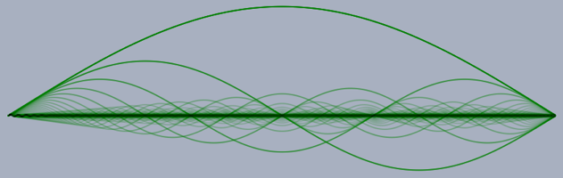

# Schwingungen einer Saite

Wie bei jedem anderen Instrument bestehen die Töne, die von einem Monochord erzeugt werden nicht aus einer (abklingenden) Sinusschwingung. Sie setzten sich stattdessen aus vielen verschiedenen Obertönen zusammen.
Im Falle einer schwingenden Saite kann man recht gut verstehen woher diese Obertöne physikalisch kommen.

Eine Saite ist im Prinzip ein gespanntes Stück Draht, das an beiden Enden fest an einem Untergrund befestigt ist und dazwischen frei schwingen kann.
Man kann sich nun die Schwingung einer Saite zusammengesetzt aus mehreren grundlegenden Teilschwingungen vorstellen,
die jeweils einem Oberton entsprechen und im Prinzip aus einer reinen Sinusschwingung bestehen.
In der <input type="button" value="Grundschwingung " style="width: 140px;" onclick="doScript(statement[0])" /> der Saite schwingt einfach die Mitte der Saite
periodisch hin und her, wobei sich die gesamte Seite in Form des Bauches einer Sinusschwingung ausbeult. Jede einzelne Stelle der Saite schwingt dabei sinusartig mit der
gleichen Frequenz (der Grundfrequenz). Die Amplitude ist dabei um so stärker, je mehr man sich in der Mitte der Saite befindet.

Neben dieser Grundschwingung gibt es aber
auch noch die <input type="button" value="2. Oberschwingung " style="width: 140px;" onclick="doScript(statement[1])" />. Bei dieser
schwingt die Saite doppelt so schnell und bildet entlang ihrer Länge zwei Wellenbäuche aus. Die Enden bleiben wie bei der Grundschwingung fest verankert.
Analog gibt es eine <input type="button" value="3. Oberschwingung " style="width: 140px;" onclick="doScript(statement[2])" />, eine <input type="button" value="4. Oberschwingung " style="width: 140px;" onclick="doScript(statement[3])" />, usw.



<input type="button" value="Grundschwingung " style="width: 140px;" onclick="doScript(statement[0])" />
<input type="button" value="2. Oberschwingung " style="width: 140px;" onclick="doScript(statement[1])" />
<input type="button" value="3. Oberschwingung " style="width: 140px;" onclick="doScript(statement[2])" />
<input type="button" value="4. Oberschwingung " style="width: 140px;" onclick="doScript(statement[3])" /> 
<input type="button" value="5. Oberschwingung " style="width: 140px;" onclick="doScript(statement[4])" />
<input type="button" value="6. Oberschwingung " style="width: 140px;" onclick="doScript(statement[5])" />
<input type="button" value="7. Oberschwingung " style="width: 140px;" onclick="doScript(statement[6])" />
<input type="button" value="8. Oberschwingung " style="width: 140px;" onclick="doScript(statement[7])" /> 
<input type="button" value="Schwingungsgemisch " style="width: 140px;" onclick="doScript(statement[8])" />
<input type="button" value="Zupfsaite " style="width: 140px;" onclick="doScript(statement[9])" /> 

Jede konkrete Schwingung der Saite setzt sich nun aus einer Überlagerung dieser Teilschwingungen zusammen.
<input type="button" value="Zupft " style="width: 80px;" onclick="doScript(statement[9])" /> man die Seite z.B. in der Mitte an so wird diese zunächst Dreicksförmig gedehnt. Diese Dehnung lässt sich
als eine ganz konkrete Überlagerung von Sinusauslenkungen darstellen. Lässt man sie los, so durchläuft diese
einen ganz charakteristischen Verformungsprozess.

Im Applet oben kann man zudem den entstehenden Klang hörbar machen (Space-Taste drücken). Hierbei ist folgendes zu beachten.
Eine Saite versetzt normalerweise die gesammte sie umgebenden Luft in Schwingung. Im Applet oben ist ein etwas anderes Modell verwirklicht.
Ähnlich dem Pick-Up bei einer E-Gitarre wird die Schwingung der Saite an einer ganz bestimmten stelle abgegriffen. Da jede Stelle der Saite
eine geringfügig unterschiedliche Bewegung durchführt ergeben sich je nach Abnahmestelle auch dadurch unterschiedliche Töne. Die Position des Pick-Ups ist
am grünen Punkt einstellbar. Die entstehende Schwingung sieht man an der ganz oben dargestellten Kurve. Der entstehende Klang wird
entsprechend der Pick-Up Position hörbar gemacht.

*Hörexperiment:* Wie verändert sich eine obertonreicher Saitenschwingung, wenn man die Position der Pickups verändert? Sind immer alle Obertöne hörbar? Was passiert in der Mitte der Saite, was am Rand?

Verschiedene Oberschwingungen einer Saite.
