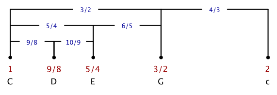

# Reine Harmonien

An diesem Beispiel kann man exakte  Verhältnisse der Saitenlängen einstellen,
indem man entweder einen der Knöpfe auswählt oder indem man exakte
Werte (für Frequenzverhältnisse im Bezug auf den Grundton) in die Textfelder einträgt (auch Brüche und andere arithmetische Ausdrücke sind erlaubt).

  


Grundton:  
<input type="button" value="110 Hz (A)" style="width: 100px;" onclick="doScript(statement[12])" />
<input type="button" value="220 Hz (a)" style="width: 100px;" onclick="doScript(statement[13])" />
<input type="button" value="440 Hz (a')" style="width: 100px;" onclick="doScript(statement[14])" /> 
Der Grundton der Saiten (der Ton bei voller Saitenlänge) kann hier gewählt werden.
---

*Frequenzverhältnisse der Obertonreihe:*  
 <input type="button" value="1:2:4" style="width: 100px;" onclick="doScript(statement[0])" />
 <input type="button" value="1:2:3" style="width: 100px;" onclick="doScript(statement[1])" />
 <input type="button" value="2:3:4" style="width: 100px;" onclick="doScript(statement[2])" />
 <input type="button" value="3:4:5" style="width: 100px;" onclick="doScript(statement[3])" />
 <input type="button" value="4:5:6" style="width: 100px;" onclick="doScript(statement[4])" />
 <input type="button" value="5:6:7" style="width: 100px;" onclick="doScript(statement[5])" /> 
Hier zunächst einige Frequenzverhältnisse, die sich direkt aus der Obertonreihe ergeben.

---

*Dur-Dreiklänge in verschiedenen Stimmungen:*  

<input type="button" value="Reine Stimmung" style="width: 150px;" onclick="doScript(statement[6])" />
<input type="button" value="Pythagoräisch" style="width: 150px;" onclick="doScript(statement[7])" />
<input type="button" value="Gleichstufig" style="width: 150px;" onclick="doScript(statement[8])" /> 

*Dur-Dreiklang in verschiedenen Stimmungen (eine Oktave höher):*  
<input type="button" value="Reine Stimmung" style="width: 150px;" onclick="doScript(statement[9])" />
<input type="button" value="Pythagoräisch" style="width: 150px;" onclick="doScript(statement[10])" />
<input type="button" value="Gleichstufig" style="width: 150px;" onclick="doScript(statement[11])" /> 

---

*... und nun etwas Musiktheorie:*

Verdopplung der Frequenz entpricht dem Interval einer Oktave.
Innerhalb einer Oktave geben wir im Folgenden das Intervall zwischen zwei Tönen als
Frequenzverhältnis an. D.h. die Oktave entspricht (1:2).
Das gleiche Verhältnis läßt sich auch durch den erweiterten Bruch (2:4) ausdrücken.
Zwischen den Zahlen 2 (doppelte Frequenz) und 4 (vierfache Frequenz) liegt noch die Zahl 3 (dreifache Frequenz).
Diese unterteilt die Oktave zwischen 2 und 4 durch einen weiteren Tonschritt.
Das Verhältnis dieser drei Töne (2:3:4) unterteilt sich in zwei reine Intervalle. Vom ersten zum zweiten Ton
ergibt sich ein Frequnzverhältnis 3/2. Dies ist eine reine Quinte. Vom zweiten zum dritten Ton ergibt sich das Frequnzverhältnis
4/3. Dies ist eine reine Quarte.

Lange Zeit war das Musikempfinden so, dass neben den Oktaven nur Quinten und Quarten als konsonante Intervalle empfunden wurden.
Die Musik der Pythagoräer bis hin ins Mittelalter war dominiert von diesem ästhetischen Empfinden. Später etablierten
sich auch Terzen und Sexten als konsonante Intervalle.
Wir erhalten Terzen durch einen ähnlichen Bildungsprozess wie beim "Einschieben" der Quinte in den Oktavabstand.
Die Terz wird quasi zwischen den Grundton und die Quinte eingeschoben.
Betrachten wir das Verhältnis (2:3) zwischen  Grundton und Quinte, so können wir auch dieses Verhältnis mit dem Faktor 2 erweitern
und erhalten (4:6). Hier läßt sich wiederum erneut eine ganze Zahl, die 5, dazwischenschieben und wir erhalten die Tonverhältnisabfolge
(4:5:6). Dies entspricht dem Dreiklang Grundton/Terz/Quinte.
Um vom Grundton auf die Terz zu kommen muss man mit dem Faktor 5/4 multiplizieren (dies entspricht dem Intervall einer reinen großen Terz). Um von der Terz auf die
Quinte zu kommen muss man mit dem Faktor 6/5 multiplizieren. Dies entspricht dem Interval der
kleinen Terz.

In vollkommen gleicher Weise kann man nun auch noch zwischen Grundton und Terz einen weiteren Ton einschieben:
Erweitert man das Verhältnis (4:5) um den Faktor 2 erält man (8:10). Wieder passt eine neue ganze Zahl dazwischen, die 9.
und man erhält die Tonabfolge (8:9:10).
Der eingeschobene Ton entspricht diesmal dem Interval Sekunde (ein Frequenzverhältnis von 9/8 zum Grundton). Dieses Intervall wird von uns als Ganztonschritt empfunden. Das folgende Bild fasst zusammen
welche wichtigen Töne wir bisher identifiziert haben und welche wichtigen Intervalle zwischen Ihnen auftreten:

Der Ton ganz links entspricht dem Grundton, unter jedem Punkt ist das Frequenzverhältnis zum Grundton angegeben. Als Referenz
sind unter den Brüchen die entsprechenden Töne einer C-Dur Tonleiter angegeben. Stimmt man töne auf diese Frequenzverhältnisse ein,
so spricht man von einer _reinen Stimmung_. Das Frequenzverhältnis (4:5:6) bezeichnet man als reinen Dur-Dreiklang.
