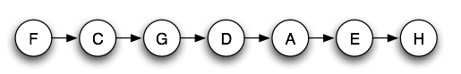
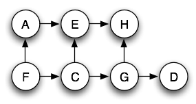
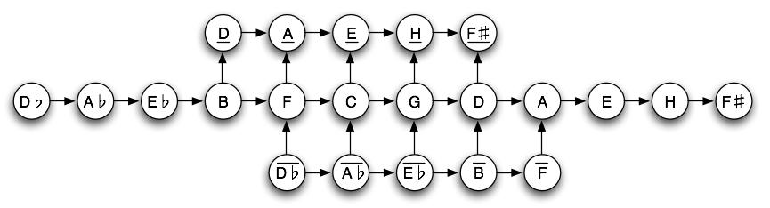
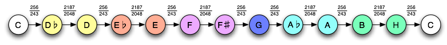
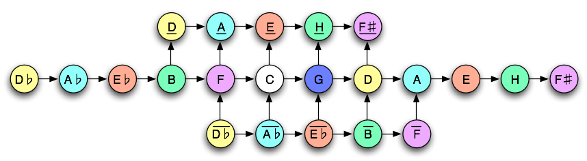

# Indische Ragas

Unsere europäischen Tonsysteme sind bei weitem nicht die einzigen Möglichkeiten einen Tonvorrat
zum Musizieren bereit zu stellen. Andere Kulturen haben andere Tonsysteme entwickelt, die
in sich zu sehr spannende und vielfältige Gestaltungsmöglichkeiten ermöglichen.

Eine sehr interessante Variante sind die Tonsysteme, die in indischen Ragas Verwendung finden.
Musik indischer Ragas bezieht sich immer auf einen Grundton (d.h. das Transponieren in andere Tonarten ist kein problem
dem sich das Tonsystem stellen muss). Dennoch ist es ein Bestreben in Ragas die Möglichkeit möglichst vieler
reiner Intervalle zu schaffen (insbesondere Quinten und Terzen).
Je nach Spielpraxis wird hierbei die Oktave in sehr viele Tonschritte unterteilt (zwischen 22 und 66).

In ihrer einfachsten Form basieren Indische Ragas  auf Skalen die aus einem Tonvorrat vonn 22 Tönen (so genannten Shrutis)
pro Oktave geschöpft werden. Weiter unten wird dieser Tonvorrat näher beschreiben.Zunächst soll die Funktionalität des Applets
beschreiben werden

Man kann im Applet:

   * Die Saiten mit der Maus spielen (anzupfen)
   * Die Saiten per Tastatur "ASDFG..." spielen
   * Jede Seite einzeln stimmen
   * An den kleinen Pfeilen gebräuchliche Raga Skalen auswählen
   * Einzelne Shrutis in die Skala hinzufügen oder weglassen
   * Bordunklang unterlegen
   * Sitar ähnlichen Klang (obertonreich) auswählen



Wir wollen den Tonvorrat indischer Ragas durch einen Vergleich mit unseren schon bekannten Tonsystemen einführen.
Betrachten wir den Tonvorrat der siebentönigen Pythagoräischen Stimmung. Er war dadurch geprägt, dass sich (bis auf die Oktavlage)
die Töne als eine Kette reiner Quinten anordnen ließen:

im Prinzip erhalten wir hier einen Teil einer waagrechte Zeile aus dem vorher eingeführtem Harmonischen Netz.
Ein Pfeil von links nach rechts steht hier für eine Quintverwandtschaft.

Bei der reinen Stimmung Traten neben den Quinten auch Terzen als wichtige Intervalle auf.
In der *C-Dur* Tonleiter wurden die Töne *A*, *E* und *H* nicht mehr so gestimmt, dass die Quintreihe fortgesetzt wird.
Vielmehr wurden diese Töne als Terzen zu *F*, *C* und *G* gestimmt.

Ein Pfeil von unten nach oben steht in diesem Bild für eine Terzverwandtschaft.

Indische Ragas nunmehr erweitern den Tonvorrat so, dass möglichst viele Quinten und auch noch viele Terzen möglich sind.
Hierfür wird (zumindest in einem der gebräuchlichsten Stimmsysteme) eine volle Quintenreihe aus dem Harmonischen Netz entnommen,
und sowohl in die eine, als auch in die andere Richtung noch Teilweise um Terzen ergänzt. Die gebräuchlichen Töne
lassen sich am Besten als Teilausschnitt aus unserem harmonischen Netz darstellen:

Waagrechte Pfeile stehen hier wiederum für reine Quinten und senkrechte Pfeile stehen für reine Terzen.
Demgemäß sind einige Töne (wie z.B. das *E*) in mehreren Stimmungen präsent. Im Diagramm wird dies durch Striche oberhalb und Unterhalb der Buchstaben angedeutet.
Das *E* oberhalb des *C* (die Terz) ist gewissermaßen eine tiefe Version des *E*, dass in der Quintreihe auftaucht.
In der Literatur werden für die genaue Position der Shrutis, im Bezug auf den Grundton verschiedene
angaben gemacht. Das bei weitem stimmigste und auch mathematisch symmetrischste System ist das hier angegebene
(welches in dieser Form z.B. von Rupak Kharvandikar veröffentlicht wurde).

Die 22 Shrutis stellen gewissermaßen das Rohmaterial dar, aus dem die Ragas erzeugt werden können.
Dieses System weißt einige bemerkenswerte Symmetrien und mathematische Besonderheiten auf.
Zum einen fällt auf, dass die 22 Töne einen Symmetrischen Ausschnitt aus dem harmonischen
Netz dasrstellen. Das Symmetriezentrum liegt hierbei nicht auf einem konkreten Ton sondern so zu sagen, in der Mitte zwischen
*C* und *G*. Von dort ausgehend werden in jede Richtung des Quintenzirkels zunächst einmal sechs Quinten hinzugenommen.
(dies entspricht zunächst der Pythagoräischen Tonleieter wie wir sie schon kennen)
Weiterhin werden zu fünf dieser Töne aufsteigenden Terzen hinzugenommen.
Und zu fünf dieser Töne werden abstiegende Terzen hinzugenommen.
Man erhält somit ein System aus 22 Tönen in dem sich sowohl die Pythagoräische, als auch die reine Tonskala wiederfindet.
Die mathematischen Besonderheiten gehen allerdings noch weiter.

Betrachten wir für einen Moment die Töne der pythagoräischen Tonleiter die der Mittelzeile auftreten. Dies sind (in der pythagoräischen Variante) die zwölf Halbtöne
unserer normalen Tonleiter. Wir haben bereits gesehen, dass, wenn man diese chromatische pythagoräische Tonleiter betrachtet (also die Töne nach ihrer Tonhöhe sortiert),
zwischen den Tönen zwei Arten von Halbton-Schritten entstehen: Kleine (mit einem Frequenzverhältnis von $256\over 243$)und Große (mit einem Frequenz Verhältnis von
$2187\over 2048$). Das folgende Bild zeigt dies schematisch. Töne die durch einen großen Halbton getrennt sind sind hier in gleicher Farbe markiert.

Die Ergänzung dieser Töne durch die ausgewählten Terzen hat nun zur Folge, dass in jeden großen Halbton-Schritt noch zwei weitere Töne eingefügt werden.
eine hohe variante des niedrigen Tones und eine niedrige Variante des hohen Tones. Das Frequenzverhältnis des Originaltons zu den Varianten beträgt dabei immer
$81/80$. Wegen

\\[
{2187\over 2048}={81\over 80}\cdot{25\over 24}\cdot{81\over 80}
\\]

tritt zwischen den Varianten ein Verhältnis von $25\over 24$ auf.
Beispielsweise wird das Intervall Intervall *Des-D* durhc zwei Töne folgendermaßen erweitert.

Die Wahl der Terzen bedingt nun dass zwischen Jedem großen Halbton zwei weitere Varianten der Töne eingefügt werden. Es entstehen somit
neben den beiden Tönen *C* und *G* noch fünf Gruppen von vier Tönen die jeweils nahe beieinander liegen und das gleich Intervallmuster aufweisen.
Zusammengehörige Tongruppen sind im nächsten Bild gleich eingefärbt:

Bringt man die 22 Shrutis in eine nach Tonhöhe aufsteigende Reihenfolge so treten dabei tatsächlich nur drei verschiedene Tonschritte auf:
$256/243, 25/24, 81/80$.

Für ein echtes Rage werden nunmehr aus diesem Vorrat von Tönen eine bestimmte Auswahl von vier bis sieben Tönen getroffen.
Auch diese Auswahl muss wiederum gewissen Regeln folgen. Darauf soll aber hier nicht eingegangen werden.
Im obigen Applet kann man durch Klicken auf die Pfeile Auswahlen  für bestimmte (in Indien wichtige) Ragas treffen.

---

Im folgenden Applet kann man sich nochmal die Töne und Frequenzverhältnisse der 22 Shrutis im harmonischen Netz
und in der Linearen Anordnung klar machen. Töne können durch Anklicken hörbar gemacht werden.



